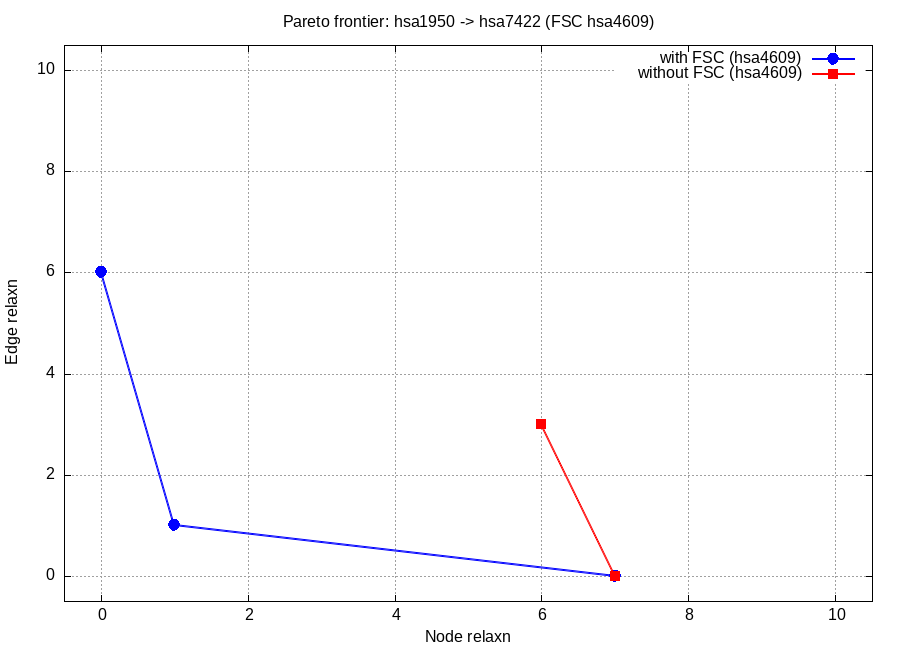
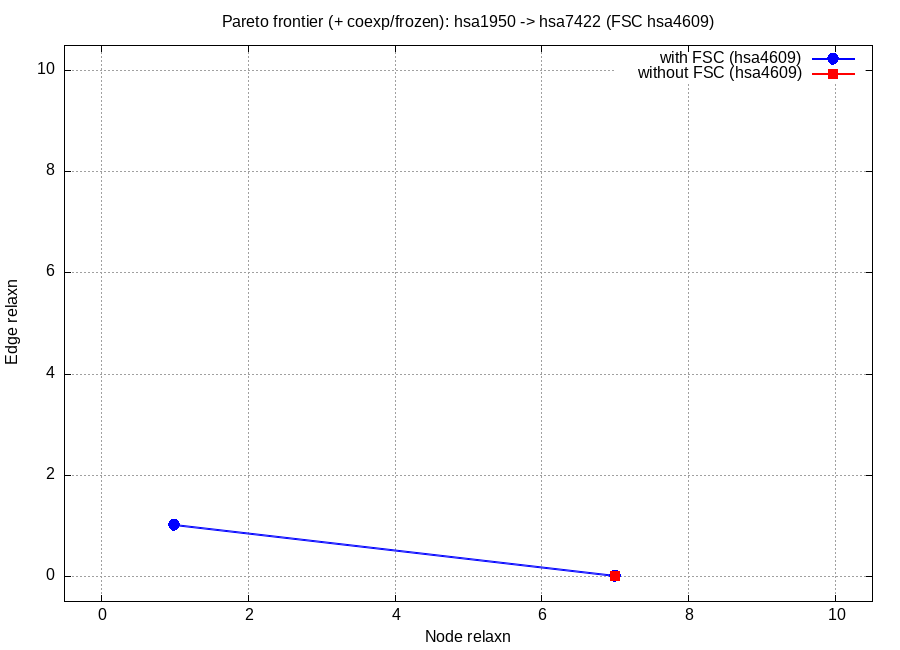

# FuSION Regression — Constraint Impact on Z3 Solve Time

Date: 2026-04-23

## Goal

Quantify the impact of **coexpression** and **frozen-edge** constraints on
Z3 solve time in the debloated `fusion` binary, and sanity-check that the
debloated binary still matches the `main` branch on the unconstrained
workload.

Pipeline follows `advtempscript.txt` exactly: for each run the batch does
`start → rgx → fb_rch → pathz3 (FSC included) → fb_rch → pathz3 (FSC
excluded) → gnuplot` and emits a single `pareto.png` overlaying the two
PO curves.

| Run | Binary | Constraints on pathz3 |
|---|---|---|
| **main baseline** | `fusion_old/Linux/fusion_main` (main branch + timing probe) | — (main has no coexp/frozen feature) |
| **debloated baseline** | `Linux/fusion` (dev-arjun debloated) | none |
| **debloated + constraints** | `Linux/fusion` | 55 coexp clauses + 31 frozen-edge clauses (each phase) |

## Workload

- Network: `hsa05200` (KEGG — Pathways in Cancer) with `experiment_score`
  annotations (`test_example/realistic_mapk/mapk.xml`).
- Source: `hsa1950` (EGF). Target: `hsa7422` (VEGFA).
- **FSC (node under test for significance)**: `hsa4609` (MYC) — canonical
  cancer hub, reachable between EGF and VEGFA.
- Reachable subgraph after `fb_rch … 15 0`: 59 nodes, 175 edges.
- Fold-change file: `test_example/fold_change.tsv`.
- Relaxation grid: `NODE_RELAX_UB = 10`, `EDGE_RELAX_UB = 10`.
- Reach-path bound 15. Z3 timeouts 60 s / 300 s.
  `NUM_SOLNS_TO_COUNT=200`, `NUM_SOLNS_TO_EXPLORE=100`.

Batches: [batch_baseline.batch](batch_baseline.batch), [batch_constrained.batch](batch_constrained.batch).

## Constraints (debloated + constraints run)

- **Coexpression**: `coexp_synthetic.csv` — 330 candidate pairs drawn from
  reachable hsa IDs, score 500 each. `coexp_threshold = 100`.
  After rep-id lookup and dedup: **55 clauses emitted** in each phase.
- **Frozen edges**: `exp_score_threshold = 400`. **31 `!edgerelax` clauses
  emitted** in each phase.

Runtime confirmation (from `debloated_constrained/run.log`, each phase):

```
Loaded 55 coexpression pairs from .../coexp_synthetic.csv at threshold > 100.00
[coexpression] emitted 55 clauses
[frozen-edge] emitted 31 clauses
```

## Per-run Pareto plots

Each run emits its own `pareto.png` via the gnuplot command at the bottom
of its batch (identical to the `advtempscript.txt` pattern). Each plot
overlays the PO curve with FSC node `hsa4609` included (blue) and excluded
(red).

### main baseline


### debloated baseline


### debloated + constraints


## PO points per run

| Run | PO with FSC (hsa4609) | PO without FSC |
|---|---|---|
| main baseline | (7, 0), (1, 1), (0, 6) | (7, 0), (6, 3) |
| debloated baseline | (7, 0), (1, 1), (0, 6) | (7, 0), (6, 3) |
| debloated + constraints | (7, 0), (1, 1) | (7, 0) |

`diff main_baseline/po_w.dat debloated_baseline/po_w.dat` empty.
`diff main_baseline/po_wo.dat debloated_baseline/po_wo.dat` empty.
Debloating did not change the unconstrained PO frontier.

Adding the constraints eliminates the `(0, 6)` point in the FSC-included
phase and eliminates `(6, 3)` in the FSC-excluded phase — those points
needed edge relaxations that are blocked by the 31 frozen high-confidence
edges.

## Solve-time summary

**pathz3 total wall-clock** (from the `std::chrono` probe added around the
handler in both binaries):

| Run | FSC-included (s) | FSC-excluded (s) | Total (s) |
|---|---|---|---|
| main baseline | 11.79 | 6.20 | 17.99 |
| debloated baseline | 11.65 | 6.29 | 17.94 |
| **debloated + constraints** | **6.50** | **3.13** | **9.63** |

Debloated+constraints vs. debloated baseline: **−8.31 s total (−46.3 %)**.
Per phase: FSC-included −44.2 %, FSC-excluded −50.2 %.

**Σ pure Z3 solver time** (summed from per-query entries in
`po_{w,wo}_limits_timefile.txt`):

| Run | FSC-incl Σ (s) | Queries | FSC-excl Σ (s) | Queries |
|---|---|---|---|---|
| main baseline | 0.2246 | 13 | 0.1525 | 14 |
| debloated baseline | 0.2195 | 13 | 0.1530 | 14 |
| **debloated + constraints** | **0.1934** | 13 | **0.1182** | 13 |

Debloated+constraints vs. debloated baseline: FSC-included −11.9 %,
FSC-excluded −22.7 %.

Main vs. debloated (both unconstrained): wall-clock within 0.3 % / 1.5 %,
Σ Z3 within 2.3 % / 0.3 %. No regression.

## Artifacts

```
comparison_results/
├── batch_baseline.batch                    # unconstrained two-phase pipeline + gnuplot
├── batch_constrained.batch                 # + coexp + frozen args on each pathz3
├── main_baseline/                          # run output
│   ├── po_w.dat, po_wo.dat                 # PO points per phase
│   ├── po_w_limits_timefile.txt, po_wo_limits_timefile.txt
│   ├── po_w_solutions.txt, po_w_relaxations.txt, po_w_mincuts, …
│   ├── pareto.png                          # gnuplot output from the batch
│   └── run.log                             # stdout incl. pathz3 wall-clock
├── debloated_baseline/                     # same structure
└── debloated_constrained/                  # same structure
```

## How to reproduce

```bash
cd comparison_results
( cd main_baseline         && ../../fusion_old/Linux/fusion_main -b ../batch_baseline.batch    > run.log 2>&1 )
( cd debloated_baseline    && ../../Linux/fusion                  -b ../batch_baseline.batch    > run.log 2>&1 )
( cd debloated_constrained && ../../Linux/fusion                  -b ../batch_constrained.batch > run.log 2>&1 )
# Each batch invokes gnuplot at the end and writes pareto.png into its run dir.
```

## Conclusion

- **Regression**: debloated matches main byte-for-byte on both phases of
  the unconstrained workload. Timing within noise. No regression.
- **Constraint impact**: adding 55 coexpression + 31 frozen-edge clauses
  cuts total pathz3 wall-clock **17.94 s → 9.63 s (−46.3 %)** and reduces
  Σ Z3 solver time by 12 %–23 % per phase on the 10 × 10 relaxation sweep
  over the EGF → VEGFA subgraph of hsa05200. The constraints also prune
  high-edge-relaxation PO points that required relaxing high-confidence
  edges.
